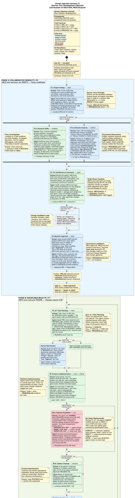

# Human Operator Guide (Quickstart + Playbook) — Antigravity Process Steward (Stories-first)

This guide explains how to run the **Stories-first, doc-driven** workflow where the **Agent** acts as a *Process Steward* and the **Human** stays in control of scope, acceptance, and architecture.

**Canonical process spec (agent must read first each session):** `process/PROCESS_REFERENCE.md`

---

## 1) Mental model

- **Story = the bridge** between Human intent and Agent execution.
  - Human defines **value + acceptance**.
  - Agent plans and executes **tasks** to satisfy acceptance.
- **Docs are the control surface** (the agent’s “memory” lives in the repo):
  - `product/PRD.md` = **what** to build (stories, acceptance, ordering)
  - `product/ARCH.md` = **how** to build (static rules; approval-controlled)
  - `product/contracts/*` = **interfaces** (schemas/contracts; RO during build unless CCR)
  - `process/PROGRESS.md` = **state + evidence** (single source of truth)
- **Deterministic verifier:** `make check` is the Definition-of-Done gate for tasks/stories.

---

## 2) Roles and responsibilities

### Human (owner of intent)
You control:
- **Vision + priorities** (what matters now)
- **Story acceptance criteria** (what “Done” means)
- **Approval-controlled truths:** scope, acceptance, architecture, contracts
- **CCR decisions** (contract changes)
- **Deployment action** (if applicable)

### Agent (owner of execution)
The agent owns:
- Proposing drafts for PRD/ARCH/contracts (when asked)
- Creating JIT task plans per story
- Implementing code + tests
- Running `make check` and logging evidence
- Maintaining `process/PROGRESS.md` as a reliable state database

**Rule of thumb:**
- Human edits **product truth**; Agent edits **process state**.
- Agent may *draft* product truth, but Human must explicitly approve before it becomes binding.

---

## 3) The Human Operator Journey

The development lifecycle runs through three sequential phases. While you can dictate tasks via natural language, using **Workflows** (slash commands like `/plan`, `/next`) acts as "macro buttons" that instantly align the Agent with the canonical framework.

Before entering the primary phases, initialize your workspace:
- **`/seed`** : Run this immediately when starting a new project. Validates local environment and dependencies.

---

## 4) Phase A: Design (Functional + Technical)

**Goal:** Converge on a stable **Story backlog** + minimal architecture/contracts so implementation can run smoothly.

**Workflows used here:**
- **`/explore`** & **`/advise`** : Use these to brainstorm architecture or research APIs before committing to code.
- **`/plan`** : Run this when you have a general vision and want the agent to draft the official PRD Story Backlog, Architecture, and Contracts.

### A1) Human-led design (minimal agent help)
1. Edit `product/PRD.md`: Fill **Vision**, add a small backlog of **stories** (S-V###) with acceptance criteria (<= 1 day slices).
2. Edit `product/ARCH.md` (optional): Set constraints, conventions, and boundaries.
3. Edit `product/contracts/*` (optional): Keep it minimal at first (schemas, endpoints).
4. Use `/explore` or `/advise` for key decisions.
5. **Session starter prompt:**
   > You are Process Steward. Read `process/PROCESS_REFERENCE.md` and `process/PROGRESS.md`. Use `/explore` for any areas I should investigate, and `/advise` for key decisions. Then validate prerequisites with `/seed` and review `product/PRD.md` — propose improvements without implementing code yet.

### A2) Agent-augmented design (vision-only from Human)
1. Put only your **vision + boundaries** in `product/PRD.md`.
2. **Session starter prompt:**
   > Process Steward mode. I only provided the vision in `product/PRD.md`. Start with `/explore` and `/advise` for key architectural decisions. Run `/seed`, then `/plan`. Draft a stories-first PRD backlog (S-V###). Draft minimal `product/ARCH.md` and baseline `product/contracts/*`. Propose changes and ask me to approve story-level scope and critical tradeoffs.
3. You approve in batches (Stories + acceptance, Key architecture choices, Contract semantics).

---

## 5) Phase B: Build (Story-by-Story)

**Goal:** The Agent implements each story autonomously as a vertical slice, with tests and evidence. Only the Agent writes code here; the Human validates acceptance.

**Workflows used here:**
- **`/next`** : The main engine. Spam `/next` to implement the next task, run tests, and log evidence.
- **`/check`** : Fast command to trigger the test suite independently.
- **`/ccr`** : Escalation trigger for contract mismatches.
- **`/archive`** : Maintenance trigger to clear out obsolete logs.

### Operating Loop
1. **Session starter prompt:**
   > Process Steward mode. Execute `/next`. Follow READ/DECIDE/ACT/VERIFY/UPDATE/ASK. Implement only what is in `product/PRD.md`. Record evidence in `process/PROGRESS.md`. Use `/advise` if architectural questions arise.
2. The agent creates a **JIT task checklist** (5–15 tasks) in `process/PROGRESS.md`.
3. You approve **only HIGH-risk tasks** if any exist.
4. The agent implements minimal code, runs tests, and logs evidence.
5. When the story tasks are completed, the agent asks for **acceptance validation**:
   - Respond **PASS** or **FAIL + notes** (e.g., "FAIL. Missing lockout after 5 attempts").

### Handling Contract Mismatches (CCR)
A CCR happens when implementation reveals a mismatch in contracts or an interface change is needed. No workarounds that bypass contracts are allowed. 
- The agent will **STOP** and log `CCR-###` in `process/PROGRESS.md` with evidence and a minimal proposal.
- You must reply with **APPROVE CCR-###**, **REJECT CCR-###**, or **DEFER CCR-###** (which safely blocks the task).

### Mid-Release Cleanup (Archiving)
If `process/PROGRESS.md` becomes too large and slows down the context:
- Run `/archive` to seamlessly sweep closed issues, resolved CCRs, and obsolete evidence into a `WIP-YYYYMMDD.md` holding file without disrupting active task state.

---

## 6) Phase C: Release & Maintenance

**Goal:** Close out the version loop, deploy, and scale to the next milestone.

**Workflows used here:**
- **`/release`** : Final workflow to trigger project hardening and generate release notes.

### Release / Post-Story Hardening
When all stories for the version are DONE:
1. **Prompt:**
   > Process Steward mode. Execute `/release`. Ensure `make check` is green, draft release notes in `process/PROGRESS.md`, and ask me for any required manual sign-off and deployment steps.
2. You decide if you require manual E2E runs, prod deploys, or smoke tests.

### Post-MVP Versions (Scaling)
For a new version (V1.1, V2, …):
1. Archive the previous release: move shipped stories/evidence out of `process/PROGRESS.md` into `process/archive/R-YYYYMMDD.md`.
2. Add new stories to `product/PRD.md` (tag them for the new version in the roadmap section).
3. In `process/PROGRESS.md`, update the **current version label** and reset milestone statuses.
4. Run `/plan` if architecture/contracts need changes; otherwise proceed with `/next`. *(Do not rename existing story IDs.)*

---

## 7) Command reference (FastAPI + uv)

- `make check` — runs lint/format/typecheck/contractcheck/tests
- `make run` — starts dev server (`uv run fastapi dev`)
- `make sync` — `uv sync`

If you need an explicit uvicorn command:
- `uv run uvicorn app.main:app --host 0.0.0.0 --port 8000`

---

## 8) If the agent stops following the process

Use a hard reset prompt:

> Stop. Re-read `process/PROCESS_REFERENCE.md` and `process/PROGRESS.md`. Resume in Process Steward mode. Use the response protocol appropriate for the current phase (see PROCESS_REFERENCE § Lightweight mode). Do not modify approval-controlled files without explicit approval.
